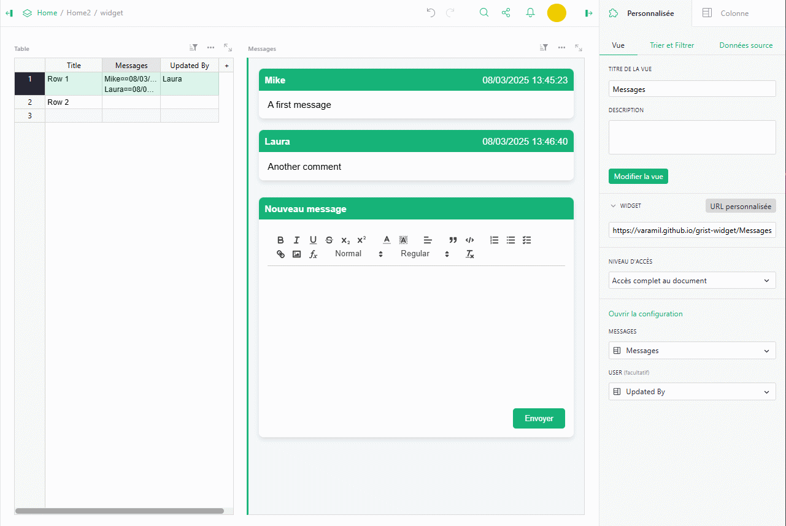
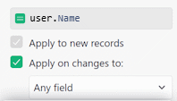

*(français plus bas)*

# Grist Message Widget
A widget to display a simple chat interface storing all messages in a row without additionnal table.

## Features
* Display messages in modern cards
* Rich text support (via [Quill](https://github.com/slab/quill)), including images, tables and formulas
* Include a form to post a new message
* Can display the sender name based Grist user name (*optional*)
* Everything is stored as html in row, no additional table required
* Localized (english, french and spanish)

## Installation
1. Choose or create a table for which you wish to add messages
2. Add a column to contain messages
3. *(Optional)* add a column and set the initialization formula to `user.Name`, check the box *Apply on changes to* then choose the column that will contain the messages (or more depending on your needs)

4. Add a new view of type *Custom* to your page by choosing as source the table that will contain your messages.
5. Select the *Custom URL* widget and paste the following URL into the field:  https://varamil.github.io/grist-widget/Messages/index.html
6. In widget configuration (right pane), authorize widget access to your table 
7. For *MESSAGES* option, select the column that will contain your messages
8. *(Optional)* select for the *USER* option the column containing the author of the changes
9. Adding a new message will update the row selected on linked widget

## Configuration
* *MESSAGES*: Select the column in the source table where to store the messages
* *USER*: *(optional)* you can select the column in the source table where to read the last sender. You need to use an auto update column with `user.Name` as init formula and *Apply on changes to* checked (optionnaly you can restrict it to the column used for messages). Clearly it's a trick because we cann't access user name with API, so when a new message is posted, the Message column is updated which trigger the User column, then this updated value is read back, and the Message column is finally updated with all information (author, date and content). Basically you can use *Updated By* shortcut ([doc](https://support.getgrist.com/authorship/#an-updated-by-column))

* *Open the configuration* : updates the widget to allow you to choose the theme used for the text editor: *Snow* formatting is done via a toolbar (like Word), *Bubble* formatting options appear when a portion of the text is selected (more compact display).

## Requirements
Grist table with at least one column containing data for the messages.

## Author
Varamil - [GitHub](https://github.com/Varamil)

# Français
*Message* est un widget pour afficher une interface de chat simple, stockant tous les messages dans une ligne sans faire appel à une table supplémentaire.

## Features
* Afficher les messages dans une interface moderne
* Supporte la mise en forme du texte (via [Quill](https://github.com/slab/quill)), incluant images, tableaux et formules
* Inclue un formulaire pour ajouter un nouveau message
* Peut afficher l'auteur basé sur le nom d'utilisateur Grist (*optionnel*)
* Tout est stocké en html dans la ligne associée, aucune table supplémentaire de nécessaire
* Multilingue (anglais, français and espagnol)

## Installation
1. Choisir ou créer un table pour laquelle vous souhaitez ajouter des Messages
2. Ajouter une colonne pour contenir les messages
3. *(Optionnel)* ajouter une colonne et définir la formule d'initialisation à `user.Name`, cocher la case *Appliquer sur les modifications à* puis choisir la colonne qui contiendra les messages (ou plus selon votre besoin)

4. Ajouter une nouvelle vue de type *Personnalisée* à votre page en choisissant comme source la table qui contiendra vos messages
5. Choisir le widget *URL personnalisé* et coller dans le champs l'URL suivante :  https://varamil.github.io/grist-widget/Messages/index.html
6. Dans la configuration du widget (volet de droite), autoriser l'accès du widget à votre table. 
7. Sélectionnez pour l'option *MESSAGES* la colonne qui contiendra vos messages
8. *(Optionnel)* sélectionnez pour l'option *USER* la colonne qui contient l'auteur des modifications
9. Ajouter un nouveau message mettre maintenant à jour la ligne sélectionnée dans le widget lié

## Configuration
* *MESSAGES* : sélectionnez la colonne qui contiendra vos messages
* *USER* : *(optionnel)* vous pouvez sélectionner une colonne dans la table source où lire le dernier auteur. Vous devez utiliser une colonne de mise à jour automatique avec `user.Name` comme formule d'initialisation et *Appliquer sur les modifications à* coché (optionnellement vous pouvez le restreindre à la colonne utilisée pour les messages). Il s'agit clairement d'une astuce car on ne peut pas accéder au nom de l'utilisateur avec l'API, donc lorsqu'un nouveau message est posté, la colonne Message est mise à jour, ce qui déclenche la colonne Utilisateur, puis cette valeur mise à jour est lue, et la colonne Message est finalement mise à jour avec toutes les informations (l'auteur, la date et le contenu). De manière simpe, vous pouvez utiliser le raccourci *Mis à jour par* ([doc](https://support.getgrist.com/fr/authorship/#une-colonne-mis-a-jour-par))

* *Ouvrir la configuration* : met à jour le widget pour permettre de choisir le thème utilisé pour l'éditeur de texte : *Snow* la mise en forme se fait via une barre d'outils (comme Word), *Bubble* les options de mises en forme apparaissent quand on sélectionne une portion du texte (affichage plus compacte).

## Exigences
Une table Grist avec au moins une colonne contenant des données pour les messages.

## Auteur
Varamil - [GitHub](https://github.com/Varamil)