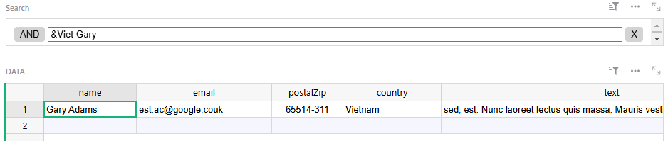
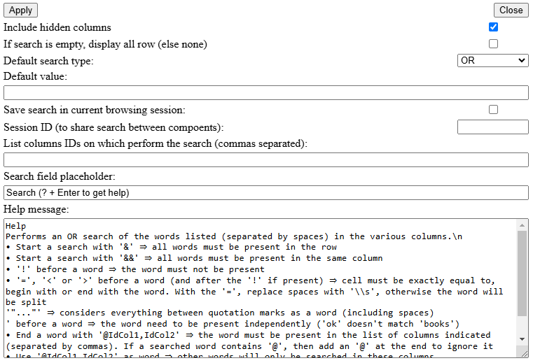

*(français plus bas)*

# Grist Simple Filer Widget
A widget to display a simple chat interface storing all messages in a row without additionnal table.

## Features
* Easy to use and quick to access 
* Supports *OR* and *ET* searches
* Supports *contains*, *starts with*, *ends with*, *exactly equals* search options
* Supports negation
* Supports regular expressions (regex)

## Installation
1. Add a new *Custom* view to your page, choosing as source the table to which you wish to add filtering
2. Choose the *Custom URL* widget and paste the following URL into the field: https://varamil.github.io/grist-widget/simplefilter/index.html then click on *Add widget*
3. In the configuration of the table to be filtered (right pane), in *Table* then *Source data*, choose the new widget for *SELECT BY*.
4. The widget is now functional

## Configuration
In the widget configuration (right-hand pane), via *Open configuration*, you can modify the filter's behavior:

* *Include hidden columns*: if unchecked, only the columns displayed will be used for the search.
* The next field lets you change the default text displayed in the search field.
* The third allows you to restrict the list of columns used by the search. Use Grist IDs (without the $) and separate them with commas. If listed columns are hidden and *Include hidden columns* is not checked, then they will be ignored.
* The last field allows you to modify the help message displayed when the user types “?"

Click *Apply* to apply the changes and then click on Grist *Save* to save them.

## Usage
Simply type the various *words* you wish to search for into the widget field. The search is launched on *Enter* or when you leave the field.

Example available here: https://docs.getgrist.com/wrUr32FUVsDo/simple-filter/p/2

## Filtering options
By default, the search is based on *OR* logic, i.e. if one of the *words* is present in the line, it will be displayed.

A *word* is a string of characters containing no spaces. Consequently, spaces are used to separate *words*. So by default, if at least one *word* is present in a line, it is displayed.

For example, `martin paul` is considered as two *words*, `martin` and `paul`, so if a line contains `martin` or `paul` or both at different positions or in different columns, then the line will be displayed.

### Global options
The following options modify the overall behavior of the filter. They should always be placed at the beginning of the search.

* `?`: displays a message summarizing the present options

* `&`: search now follows *AND* logic, all words must be present in the line for it to be displayed (but not necessarily in the same column)

* `&&`: same as `&` but all words must be present in the **same cell**

* `“...”`: considers everything enclosed in quotation marks to be part of the same word, allowing spaces to be included in a word. The whole word doesn't need to be enclosed in quotation marks `mar “tin paul”` will have the same result as `“martin paul”`. However, for regular expressions (see next paragraph), quotation marks must be outside `/` (`“/.../”`) to not be interpreted. If quotation marks are to be included in the word, use `\"` to escape.

* `@IdCol1,IdCol2`: doesn't have to be at the beginning, but must be a word in its own (so if it's at the beginning, a space is required after the last ID and before the first word). Allows you to specify the columns in which to search. Overwrites configuration, but applies to visible/hidden columns as defined in configuration. The IDs to be used are those of Grist (without the $) and must be separated by commas. Please note that case is important.

### Words options
The following options are applied to the word, and must always be at the beginning of the word:

* `!` : *negation*, indicates that the *word* **must not** be present. Must always come first, before the other modifiers listed below.

* `=` : *exactly equal*, indicates that the line must contain a cell that **exactly** contains this *word*. Use `!=` for the inverse (**is different from**) 

* `<` : *begins with*, indicates that the line must contain a cell **beginning with** this *word* (e.g. `<martin` will display lines with `martin paul` but not `jean martin`). Use `!<` for the reverse (**does not begin with**) 

* `>` : *terminates with*, indicates that the line must contain a cell **terminating with** this *word* (e.g. `>martin` will display lines with `jean martin` but not `martin paul`). Use `!<` for the reverse (**does not end with**)

* `'` : *independent word*, indicates that the text following the `'` is to be found as a “complete word”. Thus, `'ok` will display lines where the word `ok` is found, but not those containing words including `ok` such as `books` or `look`. Use `!'` to find the absence of a word, but cannot be used with `=`, `<` or `>`.

* `/` : *regex*, indicates that the line must contain a cell that **verifies** the regular expression. Directly uses the format of [JavaScript](https://developer.mozilla.org/fr/docs/Web/JavaScript/Reference/Global_Objects/RegExp). Replace spaces by `\s` or use `"` outside the regex (e.g. `"/reg ex/"`), else the regex will be split. Use `\\s` to escape. By default, `im` modifiers are used. Use `!/` for reverse (**must not verifies**). Cannot be used with `=`, `<` or `>` as it makes no sense, as regexes can handle these options (via `^` and `$`). 

* `@IdCol1,IdCol2`: must be at the end of the *word* (unlike the others). Allows you to specify the columns in which to search for the *word*. Overwrites configuration, but applies to visible/hidden columns as defined in configuration. The IDs to be used are those of Grist (without the $) and must be separated by commas. Please note that case is important. **If the search contains a `@`, add a `@` at the very end of the word to ignore** (e.g. `martin@paul.com@` to be able to search `martin@paul.com` otherwise will search `martin` in the `paul.com` column).

## Requirements
A Grist table with read access.

## Author
Varamil - [GitHub](https://github.com/Varamil)

# Français
*Simple Filter* est un widget pour effectuer un filtre rapide d'une table. 

## Fonctionnalités
* Simple d'utilisation et accès rapide 
* Supporte des recherches de type *OU* et *ET*
* Supporte des options de recherche de type *contient*, *commence par*, *termine par*, *exactement égal*
* Supporte la négation
* Supporte les expressions régulières (regex)

## Installation
1. Ajouter une nouvelle vue de type *Personnalisée* à votre page en choisissant comme source la table à laquelle vous souhaitez ajouter un filtrage
2. Choisir le widget *URL personnalisé* et coller dans le champs l'URL suivante :  https://varamil.github.io/grist-widget/simplefilter/index.html puis cliquer sur *Ajouter un widget*
3. Dans la configuration de la table à filtrer (volet de droite), dans *Table* puis *Données source*, choisir le nouveau widget pour *SÉLECTIONNER PAR*
4. Le widget est maintenant fonctionnel

## Configuration
Dans la configuration du widget (volet de droite), via *Ouvrir la configuration*, vous pouvez modifier le comportement du filtre:

* *Include hidden columns* : si décoché, seule les colonnes affichées seront utilisées pour la recherche
* Le champ suivant vous permet de modifier le text par défaut affiché dans le champ de recherche
* Le troisième, vous permet de restreindre la liste des colonnes utilisées par la recherche. Utiliser les IDs Grist (sans le $) et les séparer par des virgues. Si des colonnes listées sont cachées et que *Include hidden columns* n'est pas coché, alors elles seront ignorées
* Le dernier champ permet de modifier le message d'aide affiché quand l'utilisateur tape "?"

Faire *Apply* pour appliquer les modifications et bien cliquer sur l'*Enregistrer* de Grist pour conserver ces modifications.

## Utilisation
Simplement taper les différents *mots* que vous souhaitez rechercher dans le champs du widget. La recherche est lancée sur *Entrer* ou quand vous quittez le champs.

Un exemple est disponible ici : https://docs.getgrist.com/wrUr32FUVsDo/simple-filter/p/2

## Options de filtrage
Par défaut, la recherche se fait suivant la logique *OU*, c'est à dire que si l'un des *mots* est présent dans la ligne alors celle-ci sera affichée.

Un *mot* est une suite de charactères ne contenant pas d'espace. Par conséquent, les espaces sont utilisés pour séparer les *mots*. Ainsi par défaut si ou moins un des *mots* est présent dans une ligne, alors elle est affichée.

`martin paul` est considéré comme deux *mots*, `martin` et `paul`, et donc si une ligne contient `martin` ou `paul` ou les deux à des positions ou dans des colonnes différentes, alors la ligne sera affichée. 

### Options globales
Les options suivantes modifies le comportement global du filtre. Elles doivent être toujours placées au début de la recherche.

* `?` : affiche un message qui récapitule les présentes options

* `&` : la recherche suit maintenant la logique *ET*, tous les mots doivent être présent dans la ligne pour qu'elle soit affichée (mais pas forcément dans la même colonne)

* `&&` : comme le `&` mais alors les mots doivent être présent dans la **même cellule**

* `"..."` : considère que tous ce qui est contenu entre les quillemets fait parti du même mot, permet aini d'inclure des espaces dans un mot. Tout le mot n'a pas besoin d'être entre guillemets `mar"tin paul"` aura le même résulat que `"martin paul"`. Cependant pour les expressions régulières (voir paragraphe suivant) les guillemets doivent être à l'extérieur des `/` (`"/.../"`) pour ne pas être interprêtés. Si des guillemets doivent être inclus dans le mot, utiliser `\"` échapper.

* `@IdCol1,IdCol2` : n'a pas besoin d'être au début, mais doit être un mot à part entière (et donc s'il est au début il faut un espace après le dernier ID et le début du premier mot). Permet de spécifier les colonnes dans lesquelles faire la recherche. Écrase la configuration, mais s'applique aux colonnes visibles/cachées comme défini dans la configuration. Les IDs à utiliser sont ceux de Grist (sans les $) et doivent être séparés par des virgules. Attention, la casse est importante.

### Options de mot
Les options suivantes sont appliquées au mots, et doivent toujours être au début de celui-ci:

* `!` : *négation*, indique que le *mot* **ne doit pas** être présent. Doit toujours être en premier, avant les autres modificateurs listé ci-après

* `=` : *exactement égal*, indique que la ligne doit contenir une cellule contenant **exatctement** ce *mot*. Utiliser `!=` pour l'inverse (**est différent de**) 

* `<` : *commence par*, indique que la ligne doit contenir une cellule **commençant par** ce *mot* (ex: `<martin` affichera les lignes avec `martin paul` mais pas `jean martin`). Utiliser `!<` pour l'inverse (**ne commence pas par**) 

* `>` : *termine par*, indique que la ligne doit contenir une cellule **terminant par** ce *mot* (ex: `>martin` affichera les lignes avec `jean martin` mais pas `martin paul`). Utiliser `!<` pour l'inverse (**ne termine pas par**) 

* `'` : *mot indépendant*, indique que le texte qui suit le `'` doit être trouvé comme un "mot complet". Ainsi, `'eau` affichera les lignes où le mot `eau` est trouvé, mais pas celles qui contiendront des mots incluants `eau` tels que `gateaux` ou `rideau`. Utiliser `!'` pour trouver l'absence d'un mot, mais ne peut pas être utilisé avec `=`, `<` ou `>`.

* `/` : *regex*, indique que la ligne doit contenir une cellule qui **vérifie** l'expression régulière. Utilise directement le format de [JavaScript](https://developer.mozilla.org/fr/docs/Web/JavaScript/Reference/Global_Objects/RegExp). Remplacer les espaces par des `\s` ou utiliser des `"` à l'extérieur de la regex (ex: `"/reg ex/"`) pour que la regex ne soit pas découpée. Utiliser `\\s` pour échapper. Par défaut les modificateurs `im` sont utilisés. Utiliser `!/` pour l'inverse (**de doit pas vérifier**). Ne peut pas être utilisé avec `=`, `<` ou `>` car ça n'a pas de sens, les regex permettant de gérer ces options (via `^` et `$`). 

* `@IdCol1,IdCol2` : doit être à la fin du *mot* (contrairement aux autres). Permet de spécifier les colonnes dans lesquelles faire la recherche du *mot*. Écrase la configuration, mais s'applique aux colonnes visibles/cachées comme défini dans la configuration. Les IDs à utiliser sont ceux de Grist (sans les $) et doivent être séparés par des virgules. Attention, la casse est importante. **Si la recherche contien un `@`, ajouter un `@` à la toute fin du mot pour ignorer** (ex: `martin@paul.com@` pour pouvoir chercher `martin@paul.com` sinon va chercher `martin` dans la colonne `paul.com`)

## Limitations
La principale limitation est qu'il n'est pas possible de faire des combinaisons de *OU* et de *ET*. 

## Exigences
Une table Grist avec un accès en lecture.

## Auteur
Varamil - [GitHub](https://github.com/Varamil)